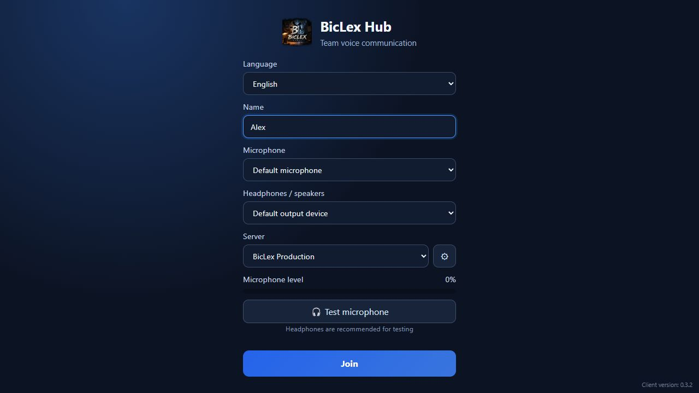

# BicLex Hub

BicLex Hub is a self-hosted team space for low-latency voice, screen sharing, persistent chat, and file exchange. It combines a native Windows client with a Rust signaling server, mediasoup SFU, and Coturn fallback.

> The project is under active development. Use a tagged release for deployments and review the security notes before exposing a server to the Internet.



## Features

- low-latency group voice powered by WebRTC and mediasoup;
- optional AI microphone noise suppression;
- system-wide mute shortcut (`Ctrl+Shift+V` by default) with in-app rebinding;
- distinct local sound cues when muting and unmuting the microphone;
- per-participant volume controls and output-device selection;
- Full HD, 1440p, and up-to-4K screen sharing;
- persistent room chat with image and file attachments;
- multiple saved self-hosted servers in one client;
- **one-click Ubuntu deployment directly from the Windows client** — no separate deployment utility is required;
- English interface by default with Russian available from the language selector;
- TURN fallback for restrictive networks;
- signed in-app updates for the Windows client.

## Architecture

```text
Windows client (Tauri 2 + TypeScript)
  ├─ WebSocket signaling / chat / files ── Rust + Axum server
  ├─ WebRTC audio and screen media ─────── mediasoup SFU
  └─ TURN fallback ─────────────────────── Coturn
```

The SFU server handles media routing; it does not provide end-to-end encryption between participants. WebRTC transport is encrypted with DTLS-SRTP.

## Quick start: Ubuntu server

Requirements:

- Ubuntu 22.04 or 24.04;
- Docker Engine with the Compose plugin;
- a public IPv4 address or a correctly configured NAT;
- TCP `8123`, TCP/UDP `3478`, and UDP `40000-40300` allowed by the firewall.

Copy the example environment and set strong unique secrets:

```bash
cp .env.example .env
editor .env
docker compose --env-file .env -f deploy/docker-compose.selfhosted.yml up -d
curl http://127.0.0.1:8123/health
```

At minimum, configure `ANNOUNCED_ADDRESS`, `ROOM_TOKEN`, `TURN_HOST`, and `TURN_PASSWORD`. Keep `.env` private. Chat history and uploaded files are stored in `./data`.

### Deploy directly from the client

The Windows client can provision a clean Ubuntu host without running the Compose commands manually:

1. open the gear button on the sign-in screen;
2. choose **Create server**;
3. enter the server address and SSH login;
4. click **Deploy** and follow the progress in the client.

The client uploads the deployment bundle, installs/configures Docker, starts BicLex Hub and Coturn, checks server health, saves the new server, and creates a shareable connection code. SSH-key authentication is the default; password authentication is opt-in and the password is not saved.

## Windows client

Download a signed installer from [GitHub Releases](https://github.com/BicLex-Games/hub/releases) when available, or build it locally:

```powershell
cd web
npm ci
npm run tauri -- build
```

Development mode:

```powershell
cd web
npm ci
npm run tauri -- dev
```

Open the server settings from the gear button. You can deploy your own Ubuntu server or paste a `BicLex-Hub|2|...` connection code shared by its owner. Treat connection codes as passwords: anyone who has one can enter that room.

The interface language defaults to **English**. Select **Русский** in the language field on the sign-in screen to switch to Russian; the selection is saved between launches.

## Repository layout

- `web/` — Tauri 2 desktop client, TypeScript UI, and `mediasoup-client`;
- `server/` — Rust/Axum signaling, chat, uploads, and mediasoup control;
- `deploy/docker-compose.selfhosted.yml` — server and Coturn deployment;
- `data/` — persistent runtime data, ignored by Git;
- `updates/` — signed client update artifacts, ignored by Git.

## Configuration

| Variable                          | Purpose                                                   |
| --------------------------------- | --------------------------------------------------------- |
| `ANNOUNCED_ADDRESS`               | Public IP advertised in mediasoup ICE candidates          |
| `ROOM_TOKEN`                      | Secret required by WebSocket, chat, and upload endpoints  |
| `RTC_MIN_PORT` / `RTC_MAX_PORT`   | mediasoup UDP port range                                  |
| `TURN_HOST`                       | Public hostname or IP of Coturn                           |
| `TURN_USERNAME` / `TURN_PASSWORD` | Coturn long-term credentials                              |
| `DATA_DIR`                        | Persistent chat and upload directory inside the container |

## Contributing

Issues and pull requests are welcome. Start with [CONTRIBUTING.md](CONTRIBUTING.md), use a focused branch, and describe how you tested user-visible changes. Please report security issues according to [SECURITY.md](SECURITY.md).

Russian documentation: [README.ru.md](README.ru.md).

## License

BicLex Hub is licensed under the [GNU Affero General Public License v3.0](LICENSE).
